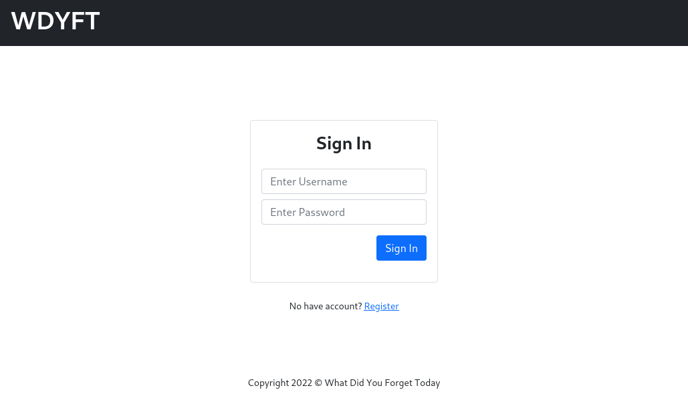
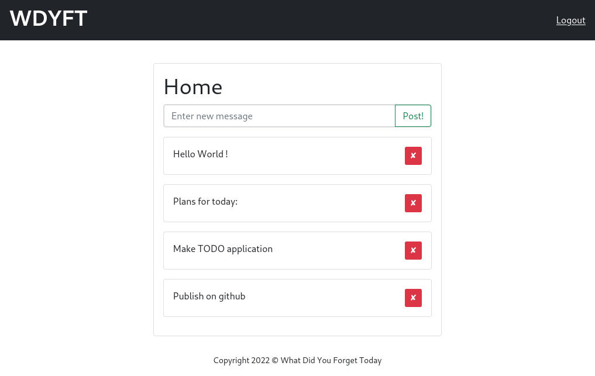

# WhatDidYouForgetToday


So WDYFT is TODO application with FastAPI and React

This application use JWT tokens for authentication, and make as an example for a my small pet-project.

## Start
1) install docker, docker-compose
2) run:
```
docker-compose up -d
```
3) Open browser and go to page: http://localhost/


### FastAPI
- sqlite
- SQLAlchemy

### React
- react-router-dom v6
- bootstrap5
- axios

## Screenshots:

# login page:


# home page:


Disclaimer:

> This code is provided as is without any express or implied warranties.
> While every effort has been taken to ensure the accuracy of the the authors/maintainers/contributors assume no responsibility for errors or omissions, or for damages resulting from the use of the program contained herein.
